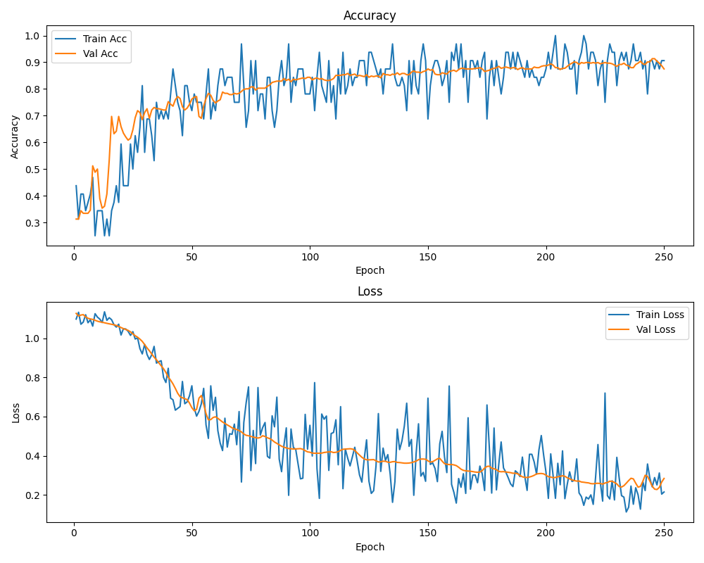

# Face Mask Classification with CNN

## 🇪🇸 Español

### 🔄 Introducción

Este proyecto es un **modelo de clasificación de mascarillas faciales** que clasifica imágenes en una de **tres categorías**:

1. **Con mascarilla**
2. **Sin mascarilla**
3. **Mascarilla mal colocada**

El modelo está basado en una red neuronal convolucional (CNN) y alcanza una **precisión en validación del 87.5%**.

Puedes usar este modelo para:

* Detectar el uso correcto o incorrecto de mascarillas en imágenes
* Automatizar la monitorización de seguridad basada en fotos

#### 📊 Precisión del Modelo

* **Precisión en Validación:**
  

---

### ⚙️ Preparación

1. **Clona este repositorio:**

## 🔄 Git LFS
Este repositorio usa Git LFS para almacenar archivos grandes como los checkpoints del modelo.

Si vas a clonar este repositorio, asegúrate de instalar Git LFS primero:
```bash
brew install git-lfs        # macOS  
sudo apt install git-lfs    # Ubuntu  
git lfs install  

```bash
git clone https://github.com/LiamKRP/FaceMaskClassification.git
cd FaceMaskClassification
git lfs pull
```

2. **Instala las dependencias:**

```bash
pip install -r requirements.txt
```

3. **Instala PyTorch y torchvision:**
   Visita [https://pytorch.org/get-started/locally/](https://pytorch.org/get-started/locally/) y copia el comando según tu sistema operativo, versión de Python y soporte CUDA.

4. (Opcional) **Utiliza el modelo entrenado en la carpeta checkpoints** o entrena el tuyo propio usando `train.py`. Puede descargar el dataset utilizado en este proyecto de: https://www.kaggle.com/datasets/spandanpatnaik09/face-mask-detectormask-not-mask-incorrect-mask e incluir las carpetas de las distintas clases en el directorio de dataset (crear si es necesario)

---

### 🔹 Inferencia

Usa el script `inference.py` para clasificar una imagen:

#### ⚙ Argumentos:

* `--model_path`: Ruta del archivo .pth del modelo guardado
* `--image_path`: Ruta de la imagen que deseas clasificar

#### ⚡ Ejemplo de Uso:

```bash
python inference.py --model_path saved_models/best_model.pth --image_path test_images/example1.jpg
```

Este comando:

* Carga el modelo
* Ejecuta inferencia sobre la imagen especificada
* Imprime la clase predicha
* Muestra la imagen con la etiqueta predicha

---


## 🌍 English

### 🔄 Introduction

This project is a **face mask classification model** that classifies images into one of **three categories**:

1. **With mask**
2. **Without mask**
3. **Mask worn incorrectly**

It was trained using a Convolutional Neural Network (CNN) and achieves a **validation accuracy of 87.5%**.

You can use this model to:

* Detect proper or improper mask usage in static images
* Automate safety monitoring in photo-based datasets

#### 📊 Performance Plot

* **Validation Accuracy:**
  

---

### ⚙️ Setup

1. **Clone this repository:**

## 🔄 Git LFS
This repo uses [Git LFS](https://git-lfs.github.com/) to store large files like model checkpoints.

If you’re cloning this repo, make sure to install Git LFS first:
```bash
brew install git-lfs        # macOS
sudo apt install git-lfs    # Ubuntu
git lfs install

```bash
git clone https://github.com/LiamKRP/FaceMaskClassification.git
cd FaceMaskClassification
git lfs pull
```

2. **Install dependencies:**

```bash
pip install -r requirements.txt
```

3. **Install PyTorch and torchvision:**
   Visit [https://pytorch.org/get-started/locally/](https://pytorch.org/get-started/locally/) and copy the correct command for your OS, Python version, and CUDA version.

4. (Optional) **Use the provided trained model inside the checkpoints folder** or train your own using `train.py`. You can download the dataset used in this project from: https://www.kaggle.com/datasets/spandanpatnaik09/face-mask-detectormask-not-mask-incorrect-mask and place the class folders inside the dataset directory (create if needed)

---

### 🔹 Inference

Use the `inference.py` script to classify an image:

#### 🔧 Arguments:

* `--model_path`: Path to the saved model checkpoint (.pth file)
* `--image_path`: Path to the image you want to classify

#### ⚡ Example Usage:

```bash
python inference.py --model_path saved_models/best_model.pth --image_path test_images/example1.jpg
```

This will:

* Load the model
* Run inference on the specified image
* Print the predicted class
* Display the image with the predicted label

---

